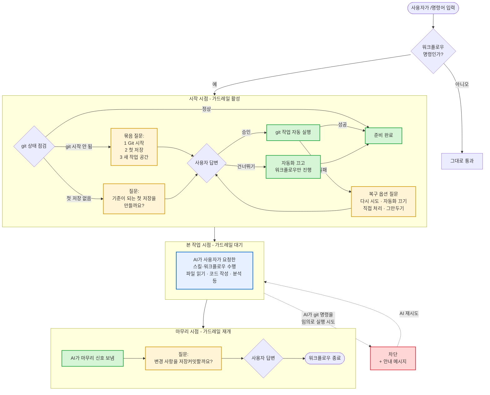

# 사용자가 직접 체감하는 기능 안내

이 문서는 **사용자가 직접 보고 답하는 기능**만 모았습니다. 내부 동작 세부사항은 [`event-handlers.md`](./event-handlers.md)에서 다룹니다.

---

## 전체 흐름

가드레일은 **워크플로우의 양 끝**(시작·마무리)에서만 적극적으로 끼어듭니다. AI의 본 작업 시간 동안에는 대기 모드로 머무르며, AI가 약속을 어기는 순간(예: git 명령을 임의로 실행)에만 차단이 발동합니다.



**색상 안내**

| 색 | 의미 |
|---|---|
| 노랑 | 사용자에게 질문 띄움 |
| 초록 | 플러그인이 자동으로 git 작업 실행 또는 진행 |
| 파랑 | AI의 본 작업 (가드레일은 대기 상태) |
| 빨강 | 가드레일이 차단을 발동 |

---

## 시점 1. `/명령어`를 입력한 직후

| 상황 | 화면에 나타나는 것 |
|---|---|
| 이 폴더에 git이 아예 없을 때 | "Git을 시작 → 기준 저장 만들기 → 새 작업 공간 만들기" 세 가지가 한꺼번에 묶인 질문 창이 뜸 |
| git은 있지만 첫 저장이 없을 때 | "기준이 되는 첫 저장(베이스라인 커밋)을 만들까요?" 질문이 뜸 |
| 정상 사용 가능한 상태일 때 | 워크플로우 규칙에 따라 "이 작업용 새 작업 공간을 만들까요?" 질문이 뜨거나, 바로 안전장치만 켜짐 |
| 워크플로우 명령이 아닐 때 | 아무 일도 일어나지 않고 그대로 통과 |
| 이전에 "건너뛰기"를 골랐던 세션 | 같은 질문을 다시 띄우지 않고, AI에게 "이 세션은 git 자동화 꺼짐"이라고 안내만 함 |

---

## 시점 2. AI가 작업하는 도중

| 상황 | 사용자가 보는 결과 |
|---|---|
| 답변 안 한 질문이 떠 있는데 AI가 다른 작업을 시도 | 그 작업이 차단되고, "지금 떠 있는 질문에 먼저 답하세요" 안내가 표시됨 |
| AI가 임의로 git 명령을 직접 실행하려 시도 | 차단되고, "Git 시작 질문을 먼저 승인하세요" 안내 표시 |
| AI가 질문 문구를 임의로 바꿔 띄우려 시도 | 차단되고, "정확한 문구와 선택지로 다시 띄우세요" 안내 표시 |

---

## 시점 3. 질문에 답한 직후

| 사용자가 누른 버튼 | 다음에 일어나는 일 |
|---|---|
| "승인" / "예" / "Initialize Git" | 실제 git 명령이 자동 실행됨. 성공하면 다음 단계로 진행 |
| "취소" / "거절" | 해당 작업이 중단됨. 다시 시도 가능한 작업이면 복구 옵션 질문이 뜸 |
| "건너뛰기" / "Skip" | 이번 git 작업을 건너뛰고 워크플로우만 진행. 이후 같은 종류 자동화는 이번 세션 동안 꺼둠 |
| 질문 창을 X로 닫음 | 일반 승인은 "건너뛰기"로 처리. 복구 질문은 그대로 유지(다시 물을 수 있음) |

---

## 시점 4. git 작업이 실패했을 때

복구 옵션 질문이 자동으로 떠서 다음 중 하나를 고를 수 있습니다.

| 옵션 | 설명 |
|---|---|
| 다시 시도 | 방금 실패한 git 작업을 한 번 더 시도 |
| 자동화 끄고 계속 | 이번 세션 동안 git 자동화를 끄고 워크플로우만 계속 |
| 직접 처리 | 사용자가 터미널에서 직접 git 명령을 해결. 끝나면 "처리 완료"라고 확인 |
| 그만두기 | 워크플로우 자체를 중단 |

---

## 시점 5. 워크플로우가 끝날 때

| 상황 | 화면에 나타나는 것 |
|---|---|
| AI 작업 중 파일이 바뀐 게 있을 때 | "변경 사항을 저장(커밋)할까요?" 질문이 뜸 |
| 원격 저장소가 연결된 경우 | "원격 저장소에 올릴까요?(푸시)" 질문이 추가로 뜰 수 있음 |
| 변경된 파일이 없을 때 | 아무 질문도 안 뜨고 그대로 종료 |

---

## 시점 6. 시작 묶음 질문이 끝나고 받는 요약

묶음 질문(`Git 시작 → 첫 저장 → 새 작업 공간`)에 답한 직후, AI 응답 끝부분에 자동으로 다음과 같은 요약이 붙습니다.

```text
[Git workflow guard — startup chain resolved]
- Git 시작: 저장소가 초기화됐습니다.
- 기준 저장: 베이스라인 커밋을 만들었습니다.
- 새 작업 공간: feat/quick-spec 브랜치로 이동했습니다.
```

→ 무엇이 됐고 무엇이 건너뛰어졌는지 한눈에 확인 가능.

---

## 시점 7. 화면에 표시되는 안내 메시지의 종류

| 안내 종류 | 언제 보이나 | 의미 |
|---|---|---|
| "Git 안전장치 활성화됨" | 워크플로우 시작 시 | AI가 임의로 git을 건드리지 않게 잠겨 있음 |
| "답변 안 끝난 질문이 있습니다" | AI가 답변 대기 중에 다른 작업을 시도 | 떠 있는 질문에 먼저 답해야 함 |
| "정확한 문구로 다시 띄우세요" | AI가 질문 헤더/선택지를 임의로 바꿔 띄울 때 | 플러그인이 지정한 헤더·옵션 그대로 재호출 필요 |
| "Git 자동화가 꺼졌습니다" | 사용자가 "건너뛰기"를 고른 직후 | 이후 git 관련 질문은 이번 세션 동안 뜨지 않음 |

---

## 자주 묻는 질문

**Q. 매번 같은 질문을 또 묻나요?**
A. 한 번 "건너뛰기"를 고르면 같은 세션 동안에는 같은 질문이 다시 뜨지 않습니다. 세션을 새로 시작하면 다시 점검합니다.

**Q. 질문 창을 실수로 닫으면 어떻게 되나요?**
A. 일반 승인 질문은 "건너뛰기"로 처리되고 워크플로우는 계속 진행됩니다. 복구 질문은 그대로 남아있어 다시 답할 수 있습니다.

**Q. AI가 git 명령을 자기 마음대로 못 돌리게 하려면?**
A. 안전장치가 기본으로 켜져 있어 AI가 `git` 명령을 직접 실행하려 하면 자동 차단됩니다. 사용자 승인 없이는 git을 건드릴 수 없습니다.

**Q. 워크플로우를 중간에 그만두려면?**
A. 복구 옵션 질문이 떴을 때 "그만두기"를 선택하거나, 세션을 종료하면 됩니다.

---

## 용어 안내

| 용어 | 풀이 |
|---|---|
| 워크플로우 | `/quick-spec`, `/dev-story` 같은 정해진 작업 흐름 명령 |
| 안전장치(가드) | 의도하지 않은 git 사고를 막는 자동 보호 기능 |
| 묶음 질문 | 워크플로우 시작 전 여러 git 단계를 한 번에 묶어 물어보는 질문 세트 |
| 첫 저장(베이스라인 커밋) | 빈 저장소에 처음 만드는 기준 저장 |
| 작업 공간(브랜치) | 본 코드와 분리해 안전하게 변경 작업하는 별도 공간 |
| 원격에 올리기(푸시) | 내 컴퓨터의 저장 내용을 팀 공용 저장소로 보내는 작업 |
| 복구 옵션 | 작업이 실패했을 때 다음 행동을 고르는 선택지 |
